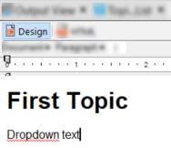

# Animated dropdowns in Adobe RoboHelp

This guide shows how to animate dropdowns in Adobe RoboHelp. With dropdowns you can fit additional content like tables or descriptive lists and reduce page space. Dropdown text elements in Adobe RoboHelp are static by default. You can animate dropdowns with JavaScript to make them look more interactive.

The script was developed by William Wan Veelden and originally described by Peter Granige. You can find the original guide [here](http://www.grainge.org/pages/authoring/twisty/twisty.htm).

I rewrote the original guide to serve as an example of my writing and adapted it for my team in Russian. [Link to the Russian version](https://drive.google.com/file/d/1vUUZudliSnd4n-I0Nd208lO-E1LaPE8J/view).

The main differences of this guide:

- simplified structure.
- usage of modern development practices, like adding the script at the end of the HTML file instead of the beginning.

Let's breakdown the script modification into 3 steps:

1. Editing the script.
2. Adding images to the project.
3. Setting up the dropdown in RoboHelp

## Editing the script

The script is stored in a JavaScript file which should be located in the project.

How to add the script to a project:

1. Copy the **twisty2b.js** file from the demo project into your project. Click [here](http://www.grainge.org/pages/authoring/twisty/rh8_twisty2b.zip) to download the project.

2. Open the file with a text editor, such as Notepad, Windows Studio Code, Notepad++, Sublime Text 3, or Atom.

3. Set the following values:

   | Value                 | Description                                                  |
   | --------------------- | ------------------------------------------------------------ |
   | `var TwistyHidden`    | Name and the format of the image for the collapsed drop-down.<br>**Example:** `up-arrow.jpg` |
   | `var TwistyShow`      | Name and the format of the image for the expanded drop-down.<br>**Example:** `down-arrow.jpg` |
   | `var OneButtonMethod` | When the value is in `true` you can add the **Expand all** and **Collapse all** buttons. In `false` you can only use the drop-down text animation. |

   > We don't recommend to modify other values if you are not familiar with JavaScript.

4. Copy the file into the project.

## Adding images to the project

The script uses two images for the animation: of the collapsed dropdown and of the expanded dropdown.

To add the images to the project:

1. Open the RoboHelp project.

2. Insert the image for the collapsed drop-down with the **Insert** > **Image** option.

   > The name and the format of the image should match the `var TwistyHidden` value in the **twisty2b.js** file.

3. Restart the project.

4. Open the **Project Manager** by one of the options:

   - **Project** > **Pods** > **Project Manager**
   - **Edit** > **Pods** > **Project Manager**

5. Press **Create a new folder** to make a new folder for the image.

6. Move the image for the collapsed folder in the created folder.

7. Press **New** > **Baggage File** to add the image for the expanded drop-down as a baggage file. 

   > The image name and format should match the `varTwistyShow` value from the **twisty2b.js file**.

## Setting up the dropdown in RoboHelp

The dropdown animation works after you set a link to the script in a specific page.

How to setup the animation in the project:

1. Enter the text for the dropdown in the **Design** tab.
   

2. Insert the image for the collapsed dropdown by selecting **Insert** > **Image**.

   > Make sure to select the image from the same folder that you previously created in the Project manager.

3. Select the dropdown text together with the image.

4. Go to the **HTML** tab.
   

5. Enter the following values for the script:

   - after the `id` attribute enter the following:

     ```javascript
     onclick="JavaScript:swapImages(this, dropdown1)" onfocus="this.blur()"
     ```

   - after the `src` attribute enter the following:

     ```javascript
     name="dropdown1"
     ```

   > The number next to the `dropdown` value should correspond to the number in the `id` attribute.
   >
   > **Example**
   >
   > For the dropdown with the `id="a2"` attribute, you should enter the following values:
   >
   > ```javascript
   > onclick="JavaScript:swapImages(this, dropdown2)" onfocus="this.blur()"
   > ```
   >
   > ```javascript
   > name="dropdown2"
   > ```

6. Add a reference to the **twisty2b.js** file after the closing `</head>` tag:

   ```html
   <script type="text/javascript" language="JavaScript" src="twisty2b.js">
   </script>
   ```

To check if the animation works, press  **View Item** on the **Project** tab or the **Edit** tab.

